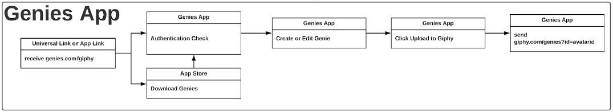

# Avatar API

The **Avatar API** allows developers to connect their users with their digital Avatars!   

Users can access a library of **Avatar Stickers** and **Avatar Animations** and take their digital expressiveness to a new level. 

## User authentication

In order to use the **Avatar API** features in your app, users **must be logged into Genies**. 

To authenticate a user you need to [**redirect** them to the Genies app](#deep-link). When landing into the Genies App the user needs to **create an account** or **log in**. After logging in, the user will be presented the Avatar Creator screen.

The Genies app will show a button for users to **get back to your app** after saving their Avatar. 

{: style="width:300px"}
{: style="width:300px"}

### Avatar Id

The authentication process [will provide an `avatarId`](#deep-link-from-genies-to-your-app) that will be used in all interactions with the **Avatar API**. The `avatarId` should be saved and associated with your user's account.

## User flow

User authentication requires using deep links between **your app** and the **Genies app**. 

### Deep link
A customized deep link will be made available to you in the [Avatar SDK approval process](overview.md#get-started_1). 

**e.g.** `https://genies.com/your_app_name`

When redirecting back to your app, Genies will use a deep link provided by you and send back the user's `avatarId`

**e.g.** `https://your_app_domain.com/genies?id=avatarId`

### Deep link from your app to Genies

In order to authenticate the user you need to open the Genies App with the provided deep link. 

Steps: 

1. **Open the Genies** app using the deep link
2. If the user is not already **logged into Genies**, the log in form will be presented
3. After logging into Genies, the user will **create their Avatar**
4. After saving the Avatar, **the Genies app will redirect the user back to your app** using the deep link and provide the user's `avatarId`

{: style="width:1200px"}

### Deep link from Genies to your app

After the user creates/edits their Avatar in the Genies App they will be redirected to your app with a deep link and will provide the user's `avatarId`. 

**e.g.** `https://your_app_domain.com/genies?id=avatarId`

The `avatarId` provided when redirected back from the Genies app **should be saved and associated with the app user**. All other **Avatar API** interactions will use the `avatarId`.

## Avatar Animations

After authenticating the user, you can use the Renderer API to generate Avatar Animations. Avatar Animations are generated as MP4 with background transparency support. 

You can find more info about working with the Avatar Animations [here](#using-avatar-animations)

## Avatar Stickers

Avatar Stickers are generated as PNG from a keyframe of an Avatar Animation. For more info see [getting a sticker](#getting-a-sticker)

## Renderer API

To generate and get **Avatar Stickers** and **Avatar Animations** the Avatar SDK provides the **Renderer API**. 

### HTTP Request URL

The Renderer API URL is: 

`https://render.genies.com`

### Getting the animations list

To get a list of animations available for a user's Avatar call `GET` `https://render.genies.com/animation/{{avatarId}}`

The `{{avatarId}}` is provided when [authenticating the user](#avatar-id). 

Every animation has a `name`, `url` and `rendering status`

The `lastModified` property represents the timestamp when the animation was generated. If the user updated their Avatar and the animation is stale, you should request a re-render to get the animation with the latest user Avatar. 

**Example**

```
curl --location --request GET 'https://render.genies.com/animation/3f8b634d-fcf6-4a24-a552-cdfda98893f5'
```

**Response**
```
[
    {
        "name": "80AerobicPoint-002",
        "url": "https://genies-dev.s3-us-west-2.amazonaws.com/3f8b634d-fcf6-4a24-a552-cdfda98893f5/80AerobicPoint-002.mp4",
        "status": "ready",
        "lastModified": 1611282457,
        "tags": [
            "animation"
        ]
    },
    {
        "name": "Anger-003",
        "url": "https://genies-dev.s3-us-west-2.amazonaws.com/3f8b634d-fcf6-4a24-a552-cdfda98893f5/Anger-003.mp4",
        "status": "ready",
        "lastModified": 1611282457,
        "tags": [
            "animation"
        ]
    }
]
```

### Getting a sticker

You can generate an **Avatar Sticker** as PNG from a keyframe of any animation by calling `GET` `https://qvvri16pqd.execute-api.us-west-2.amazonaws.com/image/{{avatarId}}/{{animationName}}`


The `{{avatarId}}` is provided when [authenticating the user](#avatar-id). The `{{animationName}}` is found in the [animations list](renderer.md#getting-the-animations-list)

Stickers should be saved and cached by the developer. 

**Example**
```
curl --location --request GET 'https://qvvri16pqd.execute-api.us-west-2.amazonaws.com/image/050ec53c-a12a-445a-9611-ff5fc3ab78f8/Laughing-004'
```

**Response**

The response is the generated photo as `image/png`. The PNG has transparency and the resolution is 1000x1000. If you need to use a different resolution please [contact the Genies Team](support.md).


### Getting an animation
You can get the MP4 for an animation by calling `GET` `https://qvvri16pqd.execute-api.us-west-2.amazonaws.com/animation/{{avatarId}}/{{animationName}}`

Animations should be saved and cached by the developer. 

**Example**
```
curl --location --request GET 'https://qvvri16pqd.execute-api.us-west-2.amazonaws.com/animation/050ec53c-a12a-445a-9611-ff5fc3ab78f8/DiscoDance-003'
```

**Response**

The response is the generated animation as `video/mp4`

### Using Avatar Animations

The animations generated by the Renderer API are supplied in a `video/mp4` format with background transparency support. 

The video files contain two video streams: the first containing the main YCbCr content, the second containing Y content representing the alpha mask.

To process the video files for your use case we recommend using FFMPEG. 

#### Transcoding to WebM
With the video in two streams, use the “alphamerge” filter element to recombine into a single stream when transcoding into formats that support alpha:

```
ffmpeg -i Combined.mp4 -filter_complex "[0:0][0:1] alphamerge" -pix_fmt yuva420p -an combined.webm
```

#### Transcoding to GIF
1. Generate palette

    ```
    ffmpeg -i Combined.mp4 -filter_complex "[0:v] palettegen" palette.png
    ```

2. Generate GIF
```
ffmpeg -i Combined.mp4 -i palette.png -filter_complex "[0:0][0:1] alphamerge [merged]; [merged][1:v] paletteuse" Combined.gif
```

#### Transcoding to PNG
To create a looping 24-bit animated PNG:
```
ffmpeg -i Combined.mp4 -filter_complex "[0:0][0:1] alphamerge" -f apng -plays 0 transcoded.png
```

To convert the video into a set of PNG frames with alpha:

```
ffmpeg -i Combined.mp4 -filter_complex "[0:0][0:1] alphamerge" frames_with_alpha%04d.png
```


