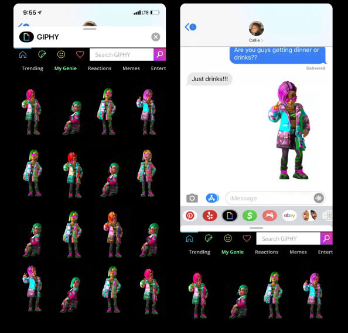
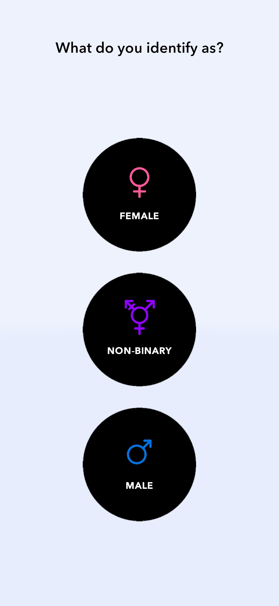

# What is Genies? 
[Genies](https://genies.com) is an avatar technology company.

We believe every human will need an avatar to represent themselves as the lines between the physical and digital worlds becomes increasingly blurred.

## Avatar SDK

**Our avatars can fit into any user story.**

Integrate the **Avatar SDK** into your app to enable your users to **create their own cinematic avatars** with millions of customizable options

The **Avatar SDK** is available in two versions: 

|                      | [Avatar API](api_overview.md)           | [Avatar Creator SDK](creator_overview.md)|
| :-------------       | :-------------------------------------- | :-----------------------------------     |
| Avatar Creator       | :material-check: Inside Genies App      | :material-check: Inside your app         |
| Avatar Stickers      | :material-check: Yes                    | :material-check: Yes                     |
| Avatar Animations    | :material-check: Yes                    | :material-check: Yes                     |

### Avatar API

The **Avatar API** allows developers to connect their users with their digital Avatars!   

Users can access a library of **Avatar Stickers** and **Avatar Animations** and take their digital expressiveness to a new level. 

In order to use the **Avatar API** features in your app, users must be logged into Genies. 

#### Features

The Avatar API has two main features: the **Avatar Stickers** and the **Avatar Animations**

With the Avatar API, you can: 

 - link a user with their Avatar Account
 - generate Avatar Stickers as PNG
 - generate Avatar Animations as MP4/Transparent MP4/GIF

{: style="width:700px"}

#### Get started
To get started, visit the [Avatar API documentation](api_overview.md).

### Avatar Creator SDK

The Avatar Creator SDK allows developers to bring the full Genies Avatar experience inside their native app! 

Users can **create their Avatar inside your app** and access their **Avatar Stickers** and **Avatar Animations** libraries.

#### Features

With the Avatar Creator SDK, you can: 

 - let the users create their **Avatar** inside your mobile app
 - render **Avatar Stickers** as PNG
 - render **Avatar Animations** as MP4/Transparent MP4/GIF

{: style="width:300px"}
{: style="width:300px"}

#### Get started
To get started, visit the [Avatar Creator documentation](creator_overview.md).

## How to get started with the Avatar SDK

### Step one: Apply for a partner account

To start using the Avatar SDK, you must first contact Genies and apply for a partner account at [avatars@genies.com](mailto:avatars@genies.com)

### Step two: Save your developer info

In your partner approval process you'll receive an API Key that will be used to authenticate your SDK usage. 
The API Key does not expire unless expressly regenerated.

### Step three: Start using the SDK
After you got your Avatar SDK approval and your API Key, it's time to start integrating your project with the [Avatar SDK](#avatar-sdk).